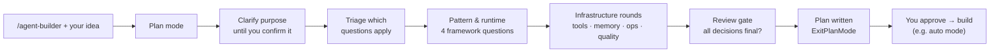

# agent-builder

[](https://github.com/crrankyy/agent-builder-skill/actions/workflows/ci.yml)
[](LICENSE)


**Plan an AI agent before any code is written. Claude recommends; you decide
every choice.**

`agent-builder` is a [Claude Code](https://code.claude.com/docs) plugin skill.
Describe the agent you want in plain language. Claude interviews you in plan
mode:

- It clarifies the purpose until nothing is ambiguous.
- It walks through every architecture and infrastructure choice as a question
  with a reasoned recommendation.
- It writes an executable build plan for you to approve.

Approve it with **"Yes, and use auto mode"** and Claude Code builds it.

```text
/agent-builder a research agent that answers competitor questions from the web and our wiki
```

## Why

Most agent projects go wrong in the first hour. Decisions get made implicitly:
the pattern, the runtime, the models, how much autonomy the agent gets, how
success is measured. agent-builder makes each of those an explicit, recorded
choice. It's based on Anthropic's published guidance on building effective
agents:

- start simple and add complexity only when it pays;
- choose the pattern by control, domain complexity, resources and expertise;
- design tools and context deliberately;
- build in observability and evals.

## How it works



- **You decide everything.** Every question lists the recommended option first,
  with a one-line *why* and the trade-offs. Nothing is assumed. Timed-out or
  empty answers are asked again, never defaulted. "You decide" works, but only
  per question, and it's logged as delegated.
- **Themed rounds.** Up to four related questions at a time. A consistency pass
  after each round flags contradictions (for example "tight budget" with
  "multi-agent swarm") and asks you how to resolve them.
- **Current facts, not stale ones.** Model IDs, package versions and APIs are
  looked up live while planning, cited in the plan, and re-verified when the
  plan executes.
- **Nothing is built until you approve.** A small hook blocks file writes and
  state-changing shell commands while the plan is being drafted (see
  [Plan guard](#plan-guard)).

## What you get

After approval, step 1 of the plan saves everything into the project:

```text
.agent-builder/
└── {agent-name}/
    ├── plan.md        # the approved plan (re-running creates plan-v2.md, never overwrites)
    └── decisions.md   # every question, the options, the recommendation, your answer
```

The plan is self-contained and written for execution in any approval mode. It
contains:

- the confirmed purpose statement and a decision table;
- the architecture, with a **Mermaid diagram**;
- the stack, with every version-specific fact **cited and dated**;
- ordered build steps, each with files, commands and an **acceptance check**;
- an **eval plan** for the agent itself (metrics, test cases, thresholds);
- risks, the evolution path, and what's out of scope.

agent-builder asks you each time whether `.agent-builder/` should be committed
or gitignored.

See [`examples/`](examples/) for the same research agent planned twice: once on
the Claude Agent SDK, once on LangGraph.

## What it can plan

| Runtime | Models | Typical fit |
|---|---|---|
| Claude Agent SDK (Python / TypeScript) | Claude (Anthropic API, Bedrock, Vertex AI, Foundry) | Standalone agents in your own app or service |
| Claude API with a custom tool-use loop | Claude | Minimal dependencies, full control, tight budgets |
| Claude Code-native: subagents, skills, hooks, MCP, headless `claude -p`, plugins | Claude | Developer agents that work on a repository |
| LangGraph (Python / JavaScript) | Via OpenRouter | Explicit, resumable graphs with human checkpoints |

Patterns covered: single agent (with skills), sequential, parallel,
evaluator-optimizer, hierarchical/supervisor, collaborative, and hybrids.
Emerging patterns are offered only when relevant, and marked experimental.

## Install

**From the marketplace** (recommended):

```text
/plugin marketplace add crrankyy/agent-builder-skill
/plugin install agent-builder@crrankyy
```

Run `/reload-plugins` if the installer asks you to.

**Manually** (skill only, without the plan guard hook):

```bash
git clone https://github.com/crrankyy/agent-builder-skill.git
cp -R agent-builder-skill/skills/agent-builder ~/.claude/skills/agent-builder
```

**For development:**

```bash
claude --plugin-dir ./agent-builder-skill
```

**Requirements:**

- Claude Code with plan mode.
- Python 3 on your `PATH`, for the plan guard. If it's missing the hook stays
  inactive, and the skill still works.

## Usage

- `/agent-builder <what the agent should do>` starts a planning session. You can
  also run it with no argument and describe the agent when asked.
- If another skill named `agent-builder` is installed locally, use the qualified
  name `/agent-builder:agent-builder`.
- Claude may also offer the skill on its own when you describe building a new
  agent. In that case it asks before starting.
- To stop at any point, say **"exit agent-builder"**. Claude ends the session
  and lifts the guard. Press Shift+Tab to leave plan mode.

## Where it works

| Environment | Behavior |
|---|---|
| Claude Code CLI, interactive | Full flow: plan mode, question dialogs, plan approval |
| Plan approval options | "Yes, and use auto mode" where auto mode is available. Otherwise "auto-accept edits" or manual approval; the plan works in all of them. |
| Headless `claude -p`, Agent SDK hosts, sessions without the question dialog | **Fallback mode**: numbered plain-text questions, the plan shown in chat, and nothing written until you reply `approve agent plan`. Continue the conversation with `--continue` or `--resume`, and allow the live lookups with `--allowedTools "Read,WebFetch,WebSearch"`. |
| VS Code extension, desktop, web | Expected to work where plan mode and questions are supported; not yet tested |

Executing a plan that writes `.claude/` or `.mcp.json` (Claude Code-native
agents) always asks for approval, even in auto mode. Claude Code protects those
paths.

## Plan guard

While a plan is being drafted, a `PreToolUse` hook
(`skills/agent-builder/scripts/plan_guard.py`, Python standard library only)
blocks two things:

- file writes and edits, except the plan file;
- shell commands that change state: package installs, mutating `git`, `rm`,
  `mv`, `cp`, `mkdir`, `touch`, `chmod`, `sed -i`, `tee`, and output redirects
  into files.

Read-only commands, such as those the project scan uses, still run.

The guard applies only to the planning session that started it. A forked
session gets a new session ID, so it isn't guarded. It lifts
automatically in any of these cases:

- you approve the plan;
- you type `approve agent plan` in fallback mode;
- you type `exit agent-builder`;
- seven days pass. If the hook itself errors, it **fails open**: the action is
allowed and a warning is shown, so a bug can never lock up your session. It's
belt-and-braces. The skill's own rules already forbid building before approval.

## Privacy and cost

- **Project scan.** Inside an existing repository the skill scans it read-only:
  a handful of files, such as the README, dependency manifests, `CLAUDE.md` and
  MCP config. It never reads `.env*` files or credentials.
- **Live lookups.** These are pre-approved only for official docs and package
  registries: Anthropic and Claude docs, LangChain docs, OpenRouter, PyPI, npm,
  GitHub and the MCP registry. Anything else asks for permission as usual.
- **Cost.** A full interview is a multi-round conversation. Expect roughly the
  cost of a long planning session. Research subagents are only started after
  you approve them.

## Development

```bash
python3 -m unittest discover -s tests -v     # plan guard tests
python3 scripts/check_repo.py                # frontmatter, description budget, version/CHANGELOG
claude plugin validate . --strict            # marketplace manifest
claude plugin validate .claude-plugin/plugin.json --strict
claude plugin eval . --allow-tools Write Edit --scaffold --judge-model sonnet --threshold 0.8
```

The eval suite in [`evals/`](evals/) checks two sets of behaviors:

- **Triggering:** the skill fires for new-agent requests and stays out of the way
  for debugging, concept questions and non-agent work.
- **Discipline:** it asks before deciding, never writes before approval, flags
  contradictions, re-asks unanswered questions, records overrides without
  pushing back, and never reads secrets.

Evals run real model calls and cost tokens, so CI doesn't run them. See
[CONTRIBUTING.md](CONTRIBUTING.md).

## Roadmap

- More model providers for LangGraph plans, beyond OpenRouter.
- Resume and amend an existing plan from `.agent-builder/` (0.2.0).

## Contributing

Issues and pull requests are welcome. Please read
[CONTRIBUTING.md](CONTRIBUTING.md) first.

## License

[MIT](LICENSE) © crrankyy

## Disclaimer

This is an independent, community project. It is not affiliated with, endorsed
by, or supported by Anthropic. "Claude" and "Claude Code" are trademarks of
Anthropic. The skill's reference material summarizes Anthropic's public guidance
on building agents, in its own words, and links to the original articles.
