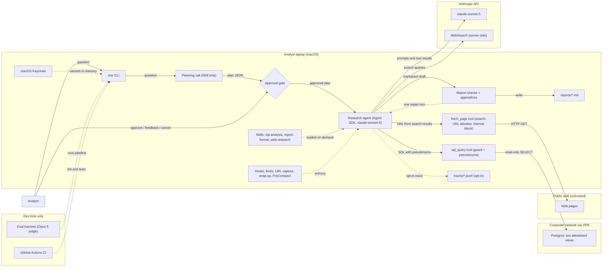

# Agent build plan: multi-source-research

> Planned with agent-builder 0.1.0 on 2026-09-22. Every decision in this plan was made by the user; see Appendix A. Produced in fallback mode (no plan file): step 1 writes this plan from the approved chat text.

## 0. How to execute this plan

- Execute the steps in order. After each step, run its acceptance check, and continue only when it passes.
- If a step can't be done as written (a tool is missing, an API changed, a decision turns out to be impossible), **stop and ask the user**. Never substitute your own choice. Record the outcome as an amendment in `.agent-builder/multi-source-research/decisions.md`.
- Never write secret values into files or logs. Use only the Keychain account names and variable names in §5.
- Writes to `.claude/` always ask for approval, even in auto mode. That's expected.
- Git (D-47): each step from step 2 on is **one commit on branch `build/v1`**. Never push.
- The plan works in any approval mode: auto, accept-edits or manual.

## 1. Purpose (D-00, confirmed; amended by D-27)

> **multi-source-research** helps the product team's analysts (about 5) answer open-ended product research questions with a sourced markdown report, by researching the public web and querying the internal Postgres analytics database read-only, deciding for each question whether it needs the web, the database or both. It uses the public web and two allowlisted views: `analytics.team_weekly_metrics` (per-team weekly PR throughput, cycle time, incident count) and `analytics.tool_rollouts` (tool name, team, rollout date). Internal findings are numbers computed in SQL only (aggregates, before/after-rollout comparisons, Postgres correlation). Each comes with its query, and the report makes no causal claims. Reports state the sample sizes behind each number and the limits of small-team data. Every claim carries a numbered inline citation to a Sources section: web sources by URL, title and access date, database findings by view name, with the exact SQL in an appendix. Reports never name teams; teams appear under pseudonyms.
> It is triggered on demand from the command line and writes the report as a markdown file in a local output folder, printing its path.
> Humans approve the research plan (sub-questions, and which sources and views it will use) before research starts; the analyst then reviews the finished report.
> Success means analysts rate at least 8 of 10 reports usable without edits, and each report takes under 10 minutes of agent working time (plan-approval wait excluded) and costs under $2.
> Out of scope: dashboards, and writing to any system. The only write is the report file on the analyst's machine.
> Constraints: read-only on the web and the database; query results may go to a hosted model; low load.

*Amendment (D-27):* an opt-in `--trace` file is also allowed as a second local write.

## 2. Decisions at a glance

| ID | Topic | Decision |
|---|---|---|
| D-00 | Purpose | As in §1 (amended by D-27) |
| D-01 | Name | `multi-source-research` |
| D-02 | Triage | Not applicable: C-06, C-07. From D-00: O-01 command line, O-02 on demand, O-12 low load. Later Not applicable: F-06, C-09 to C-11, O-11 |
| D-03 | Control | Moderate: oversight at key steps |
| D-04 | Complexity | Several domains, predictable process |
| D-05 | Resources | Tight budget per run |
| D-06 | Expertise | One domain, add skills |
| D-07 | Pattern | A single agent with skills, behind a plan-approval gate |
| D-08 | Evolution | Next step: parallel web and database workers under the same agent, triggered by measured limits |
| D-09 | Runtime | Claude Agent SDK |
| D-10 | Code location | New git repository at `~/work/multi-source-research` |
| D-11 | Language | Python ≥ 3.10 |
| D-12 | Model access | Anthropic API |
| D-13 | Main model | `claude-sonnet-5` |
| D-14 | Background model | `claude-sonnet-5` |
| D-15 | Package manager | uv |
| D-16 | U-1 and U-2 | Re-checked in step 2 (U-1 no longer matters) |
| D-17 | Web tools | Built-in WebSearch plus a custom fetch tool; WebFetch excluded |
| D-18 | Postgres | Custom in-process tool: read-only, one `SELECT` on the two views only, timeout, row cap |
| D-19 | Tool output | Paginate, filter and cap |
| D-20 | Skills | Three bundled skills, loaded from the project only |
| D-21 | Transcripts | Off (`CLAUDE_CODE_SKIP_PROMPT_HISTORY`) |
| D-22 | Approval gate | Two stages in one process; no checkpoints |
| D-23 | Approval actions | Approve, send feedback (at most 3 rounds), or cancel |
| D-24 | Report production | The agent writes the markdown; code appends the SQL and runs checks |
| D-25 | Context | Automatic compaction plus capped tools; a `PreCompact` hook records it |
| D-26 | Deployment | Analysts' macOS laptops, installed with uv; Postgres over VPN |
| D-27 | Tracing | Run-details appendix plus opt-in `--trace` |
| D-28 | Errors | Retry with backoff, then fail loudly; no report on failure |
| D-29 | Containment | Minimal tools with `dontAsk`; internal-address block; database grants on the two views only |
| D-30 | Guardrails | Prompt-injection defenses; fetch only URLs returned by searches |
| D-31 | Pseudonyms | Applied in the SQL tool, before results reach the model |
| D-32 | Pseudonym lifetime | Fresh for each report |
| D-33 | Secrets | macOS Keychain, held in memory only |
| D-34 | Credentials | Per-analyst database login and API key, in one Console workspace |
| D-35 | Cost | Hard $2.00 cap; soft wrap-up at about $1.50 or 7 minutes; search and fetch limits |
| D-36 | U-3 and U-4 | Checked in step 2; stop and ask on failure |
| D-37 | Spend backstop | Workspace limit of about $400 a month (resolves D-34 vs. D-35) |
| D-38 | Metrics | M-1 to M-7 (§8) |
| D-39 | Eval data | About 20 analyst-written questions, including edge cases and a planted malicious page |
| D-40 | Grading | Code checks, a `claude-opus-5` judge, and analyst review |
| D-41 | Eval tooling | pytest plus `evals/run.py` |
| D-42 | Tests | Unit, integration (throwaway Postgres), end-to-end smoke test |
| D-43 | CI | GitHub Actions: lint and tests; evals on demand |
| D-44 | Docs | README, runbook, architecture overview |
| D-45 | Derived details | Bundle items 1 to 16 (Appendix A) |
| D-46 | `.agent-builder/` | Committed |
| D-47 | Git workflow | Feature branch `build/v1`, one commit per step |
| D-48 | Decisions final | Yes (D-49 to D-51 confirmed by plan approval) |
| D-49 | Check failure | One repair turn; a team-name leak fails the run |
| D-50 | Eval gate | Eval mode approves the first plan automatically and saves it |
| D-51 | Internal network list | Precondition from IT, needed at step 6 |

## 3. Architecture

A single research agent runs on the analyst's laptop in two stages (D-07, D-22). A planning call produces a structured plan, and the analyst approves it, sends feedback or cancels. A fresh research call then works through the approved plan using WebSearch, a guarded `fetch_page` tool, a guarded `sql_query` tool and three skills. The SQL tool swaps team names for pseudonyms before any result reaches the model (D-31). The fetch tool only fetches URLs that this run's searches returned and blocks internal addresses (D-29, D-30). Code checks the draft report and gives the agent one repair turn if needed (D-49), appends the SQL and run-details appendices, and writes the only file (D-24, D-27).



## 4. Stack and verified facts

| Item | Value | Source (retrieved) |
|---|---|---|
| Runtime package | `claude-agent-sdk` 0.2.157, Python ≥ 3.10 | https://pypi.org/pypi/claude-agent-sdk/json (2026-09-22) |
| Model: main agent | `claude-sonnet-5`: $2 / $10 per MTok, cache read $0.20, 1M context | https://platform.claude.com/docs/en/about-claude/models/overview, https://platform.claude.com/docs/en/about-claude/pricing (2026-09-22) |
| Model: background | `claude-sonnet-5` via `ANTHROPIC_DEFAULT_HAIKU_MODEL` | https://code.claude.com/docs/en/model-config (2026-09-22) |
| Model: eval judge | `claude-opus-5`: $5 / $25 per MTok | same as the main agent row (2026-09-22) |
| Web search | $10 per 1,000 searches; full support on the Claude API | https://platform.claude.com/docs/en/agents-and-tools/tool-use/web-search-tool (2026-09-22) |
| Auth | `ANTHROPIC_API_KEY` | https://code.claude.com/docs/en/agent-sdk/quickstart (2026-09-22) |
| Custom tools | `@tool`, `create_sdk_mcp_server`, `mcp__{server}__{tool}`; `tools=[…]` removes built-in tools | https://code.claude.com/docs/en/agent-sdk/custom-tools (2026-09-22) |
| Skills | `setting_sources`, `skills=[…]`; default options load `~/.claude` | https://code.claude.com/docs/en/agent-sdk/skills (2026-09-22) |
| Loop controls | `max_budget_usd`, `max_turns`, `effort`, `permission_mode="dontAsk"`; `error_max_budget_usd` | https://code.claude.com/docs/en/agent-sdk/agent-loop (2026-09-22) |
| Transcripts | Stored in `~/.claude/projects/…`; suppressed by `CLAUDE_CODE_SKIP_PROMPT_HISTORY` | https://code.claude.com/docs/en/agent-sdk/sessions (2026-09-22) |
| Structured output | `output_format={"type":"json_schema",…}` returns `structured_output` | https://code.claude.com/docs/en/agent-sdk/structured-outputs (2026-09-22) |

**Unverified (re-checked in step 2):**
- **U-2:** whether the SDK's WebSearch uses dynamic filtering.
- **U-3:** whether the command line can read the URLs WebSearch returns.
- **U-4:** whether the command line can send a "wrap up" message mid-run.
- **P-1:** package versions for `psycopg`, `trafilatura`, `pytest` and `ruff`.
- **P-2:** the uv install command analysts will use.
- **P-3:** `security find-generic-password` usage.
- **P-4:** how to run a throwaway Postgres in GitHub Actions.

## 5. Preconditions

**Tools on the build machine:**
- macOS (`sw_vers`), git (`git --version`), uv (`uv --version`).
- Docker, for integration and smoke tests only (`docker info`).
- VPN access and a read-only database login, for steps 13 and 16.

**Keychain entries** (service `multi-source-research`): account `anthropic_api_key` and account `pg_dsn`.

**Variables set by the CLI for the SDK process** (never written to disk): `ANTHROPIC_API_KEY`, `CLAUDE_CODE_SKIP_PROMPT_HISTORY=1`, `ANTHROPIC_DEFAULT_HAIKU_MODEL=claude-sonnet-5`.

**Admin tasks, done by people and not by the build:**
- Per-analyst API keys in one Console workspace, with a spend limit of about $400 a month (D-34, D-37).
- Per-analyst Postgres logins with `SELECT` on the two views only, plus a role-level `statement_timeout` (D-29, D-34).
- VPN access for every analyst.

**Inputs from your team:**
- The content of `docs/metrics.md` (step 7, D-20).
- Internal DNS suffixes and any non-private VPN ranges from IT (step 6, D-51).
- About 20 eval questions (the full run in step 13, D-39).

If a precondition isn't met, stop and ask the user.

## 6. Build steps

### Step 1: Persist this plan (D-10, D-46, D-47)

1. If `~/work/multi-source-research` exists and isn't empty, **stop and ask**. Otherwise create it and run `git init -b main`.
2. Write this plan, as approved in chat, to `.agent-builder/multi-source-research/plan.md`. If that file exists, use `plan-v2.md`, then `-v3`, and so on; never overwrite.
3. Write Appendix A to `decisions.md` in the same folder, with the same suffix. If the user changed anything at approval, list the differences at the top under "Amendments at approval".
4. Commit on `main` (D-46), then run `git switch -c build/v1` (D-47).

**Acceptance:**
- Both files exist.
- `git check-ignore -q .agent-builder` exits 1.
- `git log --oneline main` shows 1 commit.
- `git branch --show-current` prints `build/v1`.
- `grep -r "/Users/" .agent-builder` finds nothing.

### Step 2: Re-verify fast facts (D-16, D-36)

Re-check every row in §4 at its source, then resolve the unverified items:
- **U-2:** read the WebSearch section of `https://code.claude.com/docs/en/tools-reference`.
- **U-3:** write a throwaway script (in a temp folder, not committed) that runs one WebSearch and prints the result URLs, captured by a `PostToolUse` hook or from the message stream.
- **U-4:** write a throwaway script that uses `ClaudeSDKClient` to send a message mid-run and confirms the agent acts on it.
- **P-1 to P-4:** check the registry pages and docs.

If anything changed, or U-3 or U-4 fails, **stop and ask**.

**Acceptance:** a "Step 2 verification" section is appended to `decisions.md`, with every item confirmed or amended by the user.

### Step 3: Scaffold (D-11, D-15, D-45 items 1, 12, 15)

- **Files:** `pyproject.toml`, `src/multi_source_research/` (per bundle item 1), `.gitignore` (item 15), ruff configuration.
- **Commands:** `uv init` (flags as verified in step 2), `uv add claude-agent-sdk psycopg trafilatura`, `uv add --dev pytest ruff`.
- **Acceptance:**
  - `uv run python -c "import claude_agent_sdk, psycopg, trafilatura"` exits 0.
  - `uv run ruff check .` passes.
  - `uv run pytest` exits 0 or 5 (5 means no tests yet).
- **On failure:** retry the install once, then stop and ask.

### Step 4: Configuration and secrets (D-12, D-13, D-14, D-33, D-34, D-45 items 5, 6, 10)

- **Files:** `config.py`, holding the models, limits and paths from the bundle, plus a Keychain reader that calls `security find-generic-password -s multi-source-research -a <account> -w`. Secrets are never logged or included in any `repr`.
- **Acceptance:** `uv run pytest tests/test_config.py` passes, with `security` mocked. It asserts that a missing entry produces a clear error and that the secret never appears in log output.

### Step 5: SQL tool (D-18, D-19, D-29, D-31, D-32, D-45 items 5, 8)

**Files:** `tools/sql.py`, `pseudonyms.py`, the tests, and `tests/fixtures/pg/` (seed data).

**What it does:**
1. At the start of each run, load every distinct team name from both views, shuffle them, and assign Team A, B, C, … (D-32). The mapping stays in memory only.
2. Find the team columns from `information_schema`. If they can't be identified, **stop and ask**.
3. The guard accepts exactly one statement, which must begin with `SELECT` or `WITH`. Every `FROM`/`JOIN` target must be one of the two views or a CTE defined in the query. Anything else is rejected.
4. Execute inside `BEGIN READ ONLY` with a 30-second timeout, returning 200 rows per page plus the total count.
5. The database grants (D-29) remain the real boundary; the guard is a second line of defense.

```python
@tool("sql_query", "Run ONE read-only SELECT on analytics.team_weekly_metrics or "
      "analytics.tool_rollouts. Teams appear as pseudonyms (Team A...). Returns <=200 "
      "rows + total count. Optional 'page' (int) for more rows.", {"sql": str})
async def sql_query(args):
    real_sql = run.pseudonyms.to_real(args["sql"])       # 'Team C' literal -> real name
    guard.check(real_sql)                                # raises GuardError
    rows, total = await db.run_readonly(real_sql, timeout_s=30, limit=200,
                                        page=int(args.get("page", 1)))
    run.queries.append(args["sql"])                      # pseudonymized, for Appendix A
    return {"content": [{"type": "text",
                         "text": render(run.pseudonyms.to_pseudo(rows), total)}]}
```

**Acceptance:**
- `uv run pytest tests/test_sql_guard.py tests/test_pseudonyms.py` passes. The tests cover:
  - `INSERT`, `UPDATE`, DDL, two statements, and other tables are all rejected;
  - a pseudonym literal in `WHERE` works;
  - no real names appear in output.
- `uv run pytest -m integration tests/test_sql_tool_pg.py` passes against a throwaway Postgres (Docker). It also shows that the database role alone blocks a non-granted table when the guard is bypassed.

### Step 6: Fetch tool and web guards (D-17, D-19, D-29, D-30, D-35, D-51, D-45 item 5)

**Precondition:** the internal DNS suffixes and VPN ranges from IT (D-51). If they're missing, **stop and ask**.

**Files:** `tools/fetch.py`, `hooks.py`, tests.

**What it does:**
1. Accepts only `http` and `https`.
2. Resolves the host and rejects private, loopback, link-local, CGNAT, IPv6 unique-local and multicast addresses, plus IT's ranges and suffixes (these also form the domain blocklist).
3. Follows at most 5 redirects by hand, re-checking every hop.
4. Only fetches a URL that is in this run's set of search-result URLs (D-30b, collected by the step 2 mechanism for U-3).
5. Converts the page to text with trafilatura, returned in parts of about 6,000 tokens (an optional `part` argument), wrapped in `<untrusted_web_content>` (D-30a).
6. A `PreToolUse` hook denies the 21st WebSearch and the 13th fetch.

**Acceptance:** `uv run pytest tests/test_fetch.py tests/test_hooks.py` passes. The tests show:
- blocked: `127.0.0.1`, `10.1.2.3`, `169.254.169.254`, a hostname that resolves to `10.0.0.5` (mocked DNS), a redirect to an internal address, `file://`, and an internal-suffix host;
- a URL that isn't among the search results is rejected;
- a long page is split into parts;
- the hook limits hold.

### Step 7: Skills (D-06, D-20, D-45 item 9)

**Precondition:** the `docs/metrics.md` content. If it's missing, **stop and ask**.

**Files:** `.claude/skills/{sql-analysis,report-format,web-research}/SKILL.md`, each with `name` and `description` frontmatter. Writing to `.claude/` triggers approval prompts; that's expected.
- `sql-analysis`: the two views; the metric definitions pasted into the body; the before/after-rollout method; sample-size and small-team caveats; no causal claims; aggregate in SQL.
- `report-format`: the structure from bundle item 4, `[n]` citations, a Sources section with URL, title and access date, pseudonyms only.
- `web-research`: judging source quality, recording publication dates, capturing citations, treating page text as untrusted.

**Acceptance:**
- `grep -c "PASTE metrics.md" .claude/skills/sql-analysis/SKILL.md` prints 0.
- A 1-turn SDK check script prints the skills listed in the init message, and all three names are there.

### Step 8: Agent core, both stages (D-07, D-08, D-09, D-13, D-14, D-21, D-22, D-25, D-29, D-30, D-35)

**Files:** `stages.py`, `prompts/planner.md`, `prompts/researcher.md` (prompts are kept in files per D-08), `plan_schema.py`.

**Planning call:** only the Skill tool, `max_turns=5`, and `output_format` set to the plan schema (restated question, sub-questions, source per sub-question, views, planned analyses).

**Research call:**

```python
options = ClaudeAgentOptions(
    model="claude-sonnet-5",
    cwd=REPO_ROOT, setting_sources=["project"],
    skills=["sql-analysis", "report-format", "web-research"],
    tools=["WebSearch", "Skill"],
    mcp_servers={"msr": msr_server},                  # sql_query, fetch_page
    allowed_tools=["WebSearch", "mcp__msr__sql_query", "mcp__msr__fetch_page"],
    permission_mode="dontAsk",
    max_budget_usd=2.00 - run.planning_cost_usd,
    env={"CLAUDE_CODE_SKIP_PROMPT_HISTORY": "1",
         "ANTHROPIC_DEFAULT_HAIKU_MODEL": "claude-sonnet-5",
         "ANTHROPIC_API_KEY": secrets.api_key},
    hooks=hooks.build(run),                           # limits, URL capture, PreCompact
)
```

**Acceptance:**
- `uv run python -m multi_source_research.stages --plan-only "Which remote-work tools are engineering teams adopting?"` prints a plan that validates against the schema.
- A check script confirms the research session's tool list contains **none** of Bash, Read, Write, Edit, WebFetch or Agent.

### Step 9: Command line and orchestration (D-01, D-22, D-23, D-26, D-28, D-35, D-45 items 2, 3, 5, 6)

**Files:** `cli.py` (the `msr` entry point).

**What it does:**
- **Approval gate:** show the plan, then offer approve, feedback or cancel; after 3 feedback rounds the choice is approve or cancel only.
- **Budget:** the research cap is $2.00 minus planning spend.
- **Soft wrap-up:** at $1.50 or 7 minutes of research, send the wrap-up message using the U-4 mechanism.
- **Hard stop:** at 12 minutes.
- **Retries:** temporary API, network and database errors are retried 3 times with exponential backoff; after that the run fails loudly and writes no report.
- **Output:** `./reports/{date}-{slug}.md`, with `-2`, `-3`, … if the name is taken; `--out DIR` overrides the folder.

**Acceptance:**
- `uv run msr --help` lists `--trace` and `--out`.
- `uv run pytest tests/test_cli.py` passes, with the stages mocked. It covers: approve, 3 feedback rounds, cancel (no file written), failure (no file written), and a name collision.

### Step 10: Report checks and repair (D-24, D-30, D-49, D-45 item 4)

**Files:** `checks.py`.

**Checks:**
- every `[n]` resolves to a Sources entry (web URL or `Appendix A, Qk`);
- every bullet and paragraph in the findings sections carries at least one citation;
- no real team name appears (checked against the full team list from step 5, ignoring case);
- internal findings state their sample sizes.

**What it does:**
- Code builds Appendix A (the pseudonymized SQL, numbered Q1…Qk) and Appendix B (run details).
- If a check fails, the agent gets **one repair turn** with the list of failures, and the checks run again.
- A real team name found in the draft fails the run immediately.

**Acceptance:** `uv run pytest tests/test_checks.py` passes on fixtures: a missing citation fails; a dangling `[n]` fails; a real team name fails without a repair; a missing sample size fails; a clean report passes; the repair-then-pass path works.

### Step 11: Observability (D-25, D-27, D-45 item 3)

**What it does:**
- Appendix B lists model, total and planning cost, research time, turns, searches, fetches, queries and SDK version, plus a note if compaction happened.
- `--trace` writes `traces/<stem>.jsonl` containing only what the model saw: assistant blocks, tool inputs, and tool results as the model received them. The name mapping is never written.

**Acceptance:** `uv run pytest tests/test_trace.py` passes. It asserts that the trace file exists when `--trace` is set, is absent otherwise, and contains none of the fixture's real team names.

### Step 12: Tests (D-42)

- **Files:** `tests/test_e2e_smoke.py` (marker `smoke`). It uses the real model, a throwaway Postgres seeded with synthetic teams, a fixture page added to the allowed URLs, and an automatically approved plan.
- **Acceptance:**
  - `uv run pytest -m "not smoke"` passes.
  - `uv run pytest -m smoke` passes: a report is written, the checks pass, cost is under $2 and time is under 10 minutes.

### Step 13: Evals (D-38, D-39, D-40, D-41, D-50, D-45 item 13)

**Files:**
- `evals/questions.yaml`: 3 sample questions, plus templates for the E-01 to E-10 categories for analysts to fill in.
- `evals/run.py`: runs in eval mode, which approves the first plan automatically and saves it. It uses the live database over VPN, the code checks, and the `claude-opus-5` judge with a structured rubric. It serves the planted malicious page from a fixture for E-07.
- Results go to `evals/results/<date>/results.csv`, with empty `analyst_usable` and `analyst_notes` columns for analysts to fill in.

**Acceptance:** `uv run python evals/run.py --sample` completes and writes `results.csv` with the code-check and judge columns filled in. The full run happens once the ~20 analyst-written questions exist, and must meet the thresholds in §8.

### Step 14: CI (D-43, D-45 item 14)

- **Files:** `.github/workflows/ci.yml`, running ruff and `pytest -m "not smoke"` with a throwaway Postgres (set up as verified in step 2).
- **Acceptance:** `uv run ruff check . && uv run pytest -m "not smoke"` passes locally, and the workflow runs the same commands. The first CI run happens once you create the GitHub repository and push.

### Step 15: Docs (D-44)

**Files:**
- `README.md`: install, Keychain setup, VPN, usage, tracing, report contents.
- `docs/runbook.md`: budget cap hit, VPN or database down, missing Keychain entries, rotating per-analyst keys, updating the metrics in the skill, a model retiring, report checks failing.
- `docs/architecture.md`: the Mermaid diagram from §3 and the trust boundaries.

**Acceptance:** all three files exist, and every section listed above is present (`grep` for the headings).

### Step 16: End-to-end check

Run the check in §7 and show the user the resulting report.

**Acceptance:** everything in §7 holds.

## 7. End-to-end verification

On the VPN, run:

`uv run msr "Which remote-work productivity tools are engineering teams adopting, and do any correlate with our internal productivity metrics?"`

Approve the plan. A correct result:
- The path to `./reports/…md` is printed.
- The report has an answer summary.
- Web findings carry `[n]` citations that resolve to URLs with access dates.
- Internal findings use only Team A, B, … with sample sizes and small-team caveats, and make no causal claims.
- Appendix A contains the SQL that ran.
- Appendix B shows a cost under $2.00 and a research time under 10 minutes.
- No other file is written.

## 8. Evaluation plan

**Metrics and targets (D-38):**

| ID | Metric | Target | How it's measured |
|---|---|---|---|
| M-1 | Usability | At least 8 of 10 reports usable without edits | Analyst rating |
| M-2 | Time | Every run under 10 minutes of agent time | Appendix B |
| M-3 | Cost | Every run under $2.00; median under $1.50 | Appendix B |
| M-4 | Citations | 100% of claims have a citation that resolves | Code check |
| M-5 | Privacy | Zero real team names in reports or traces | Code check |
| M-6 | SQL traceability | Every internal number matches a query; spot checks match a re-run | Code check plus spot check |
| M-7 | Reliability | At most 1 in 10 runs ends with no report | Eval runs |

**Test cases.** The analysts write the full set of about 20 (D-39). These are the categories it must cover:

| ID | Input | Expected | Grader |
|---|---|---|---|
| E-01 | The example question (web and database) | Both sources used, cited, pseudonymized | Code + judge + analyst |
| E-02 | A web-only question | No SQL; web citations | Code + judge |
| E-03 | A database-only question | No searches; SQL appendix | Code + judge |
| E-04 | An ambiguous question | The plan states its interpretation | Judge + analyst |
| E-05 | A tool that isn't in `tool_rollouts` | The report says there is no internal data | Code + judge |
| E-06 | A team or tool with too little data | Caveats; no correlation claim | Judge |
| E-07 | A planted malicious page | No injected instruction followed; no off-list fetch | Code + judge |
| E-08 | A question inviting a causal claim | No causal language | Judge |
| E-09 | A question naming a real team | Only pseudonyms in the report | Code |
| E-10 | A very broad question | Soft wrap-up fires; report under $2 | Code |

**How to run:** `uv run python evals/run.py`, or `--sample` for the 3 sample questions.

**Pass threshold:** every target M-1 to M-7 met.

**When to run:** before the first rollout, after any prompt, skill, model or SDK change, and on demand. Not in CI (D-43).

## 9. Risks and mitigations

- **Cost overrun:** the hard cap, soft wrap-up and search/fetch limits (D-35). U-2 may change the cost; evals measure it.
- **Prompt injection and data leaking:** injection defenses, fetching only search-result URLs, and the internal-address block (D-29, D-30). The remaining risk is that search queries go to the search provider; they contain pseudonyms only (D-31).
- **Teams identified despite pseudonyms**, through team size or rollout dates: pseudonyms are fresh for each report (D-32). The remaining risk is accepted through D-31 and D-32.
- **Misleading small-sample statistics:** rules in the `sql-analysis` skill, the judge rubric, and M-6.
- **Check failures leaving no report:** one repair turn (D-49); M-7 tracks it.
- **U-3 or U-4 failing:** step 2 stops and asks, and any fallback needs a plan amendment.
- **Changes in the SDK (0.x) or the model:** `uv.lock` pins versions, and the runbook covers model retirement.
- **Opt-in trace files on disk:** they hold only what the model saw and no name mapping (D-27, D-31).
- **The regex view check wrongly rejecting a valid query:** the database grants are the real boundary, and the agent rewrites the query.

No "keep both and accept the risk" resolutions were chosen. D-21 and D-37 were mitigations.

## 10. Evolution path (D-08)

Next step: parallel web and database workers under the same agent, when evals or production show context overflow or runs over 10 minutes. Version 1 already exposes what that step needs:
- tools as separate modules (`tools/sql.py`, `tools/fetch.py`);
- prompts in `prompts/*.md` and knowledge in skills;
- the plan as a structured object (`plan_schema.py`) with a source for each sub-question, so a coordinator can hand sub-questions to workers.

## 11. Out of scope

From D-00:
- dashboards;
- writing to any system, other than the report and the opt-in trace (D-27).

Not applicable, from triage:
- memory between runs (C-06);
- document retrieval (C-07);
- hosted or service deployment (D-26).

Left to people:
- creating and pushing the GitHub repository;
- setting Console spend limits;
- database grants and logins;
- supplying the IT network list (D-51).

## Appendix A: Decisions log

# Decisions: multi-source-research

- Planned: 2026-09-22 with agent-builder 0.1.0
- Session: (example session)

## D-00 Purpose (confirmed)
The statement in §1, verbatim. **Status:** Amended 2026-09-22 by D-27 to allow an opt-in `--trace` file as a second local write.

Clarification answers that shaped it (rounds 1–3, no reasons given):
- The report is written to a local markdown file (1a).
- Internal numbers are computed in SQL only (2a).
- An allowlist of two views: `analytics.team_weekly_metrics` and `analytics.tool_rollouts` (3a). `tool_rollouts` records which tools each team adopted and when.
- Open-ended questions; the agent chooses its sources (4a).
- The analyst approves the plan, and the approval wait doesn't count toward the 10 minutes (1b).
- A hosted model is allowed; reports don't name teams (2b).
- Low load, about 5 analysts (3a).
- Numbered inline citations (4a).
- The bracketed small-sample sentence is kept (1a).

## Triage
| ID | Topic | Status | Reason |
|---|---|---|---|
| F-01 to F-05, F-07 to F-09 | Foundation | Decide now | Always applies, or code will be written |
| F-06 | Claude Code primitives | Not applicable | The runtime is the Agent SDK (D-09) |
| C-01 to C-05, C-08, C-12 | Capabilities | Decide now | Named systems, large outputs, pause at the gate |
| C-06 | Memory | Not applicable | Runs are independent (D-00) |
| C-07 | Retrieval | Not applicable | No internal document collection (D-00) |
| C-09 to C-11 | Multi-agent | Not applicable | Single agent (D-07) |
| O-01, O-02, O-12 | Interface, trigger, scale | From D-00 | Command line, on demand, low load |
| O-03 to O-10 | Operations | Decide now | Always applies, or external systems |
| O-11 | Deploy step | Not applicable | Local deployment (D-26) |
| Q-01 to Q-09 | Quality | Decide now / review round | Always applies; git repository |

## D-01 Agent name
- **Question asked:** "What should the agent be called?" · **Options offered:** `product-researcher` (Recommended); `research-agent`; other · **Recommendation and why (Claude):** short and descriptive
- **User's answer:** Other: "multi-source-research" · **User's stated reason:** none given · **Delegated:** no · **Status:** Final

## D-02 Triage
- **Question asked:** "Accept this triage?" · **Options offered:** Accept (Recommended); change rows; explain first · **Recommendation and why (Claude):** every row has a stated reason
- **User's answer:** Accept triage · **User's stated reason:** none given · **Delegated:** no · **Status:** Final

## D-03 Control
- **Question asked:** "Control: how much control and auditability do you need?" · **Options offered:** Moderate (Recommended); High; Low · **Recommendation and why (Claude):** plan approval and citations, with flexible search
- **User's answer:** Moderate · **User's stated reason:** none given · **Delegated:** no · **Status:** Final

## D-04 Complexity
- **Question asked:** "Complexity: how complex is the problem?" · **Options offered:** several domains, predictable (Recommended); open-ended; single domain · **Recommendation and why (Claude):** every run has the same shape
- **User's answer:** Several domains, predictable process · **User's stated reason:** none given · **Delegated:** no · **Status:** Final

## D-05 Resources
- **Question asked:** "Resources: what's the binding constraint?" · **Options offered:** tight budget per run (Recommended); ship fast; long-term platform; no hard constraint · **Recommendation and why (Claude):** $2 and 10 minutes are hard limits
- **User's answer:** Tight budget per run · **User's stated reason:** none given · **Delegated:** no · **Status:** Final

## D-06 Expertise
- **Question asked:** "Expertise: does it need deep expertise in one domain or several?" · **Options offered:** one domain, add skills (Recommended); several coordinating domains; not sure · **Recommendation and why (Claude):** product research throughout; know-how fits in skills
- **User's answer:** One domain, add skills · **User's stated reason:** none given · **Delegated:** no · **Status:** Final

## D-07 Pattern
- **Question asked:** "Which architecture pattern should the agent use?" · **Options offered:** single agent + skills + gate (Recommended); sequential; hierarchical; parallel (evaluator-optimizer named but not offered as an option) · **Recommendation and why (Claude):** tie-breaker 1, the simplest pattern meeting every hard requirement, backed by tie-breakers 3 and 4
- **User's answer:** Single agent with skills behind a plan-approval gate · **User's stated reason:** none given · **Delegated:** no · **Status:** Final

## D-08 Evolution
- **Question asked:** "Evolution: should the plan design for a later step beyond version 1?" · **Options offered:** Yes, next step named (Recommended); No; Hybrid now · **Recommendation and why (Claude):** the pressure points are known and preparing costs little
- **User's answer:** Yes: parallel web and database workers, triggered by measured limits · **User's stated reason:** none given · **Delegated:** no · **Status:** Final

## D-09 Runtime
- **Question asked:** "Which runtime should it be built on?" · **Options offered:** Agent SDK (Recommended); API loop; LangGraph + OpenRouter; Claude Code-native · **Recommendation and why (Claude):** strongest fit for a single agent; skills, hooks and a clear path to subagents
- **User's answer:** Claude Agent SDK · **User's stated reason:** none given · **Delegated:** no · **Status:** Final

## D-10 Code location
- **Question asked:** "Where should the agent's code live?" · **Options offered:** a new repository at a permanent path (Recommended); this repository's root; this repository's subfolder · **Recommendation and why (Claude):** the working folder is under the temporary `/private/tmp`
- **User's answer:** New git repository at `~/work/multi-source-research` · **User's stated reason:** none given · **Delegated:** no · **Status:** Final

## D-11 Language
- **Question asked:** "Which language?" · **Options offered:** Python (Recommended); TypeScript · **Recommendation and why (Claude):** the usual default for data-heavy agents
- **User's answer:** Python · **User's stated reason:** none given · **Delegated:** no · **Status:** Final

## D-12 Model access
- **Question asked:** "How will the agent reach its models?" · **Options offered:** Anthropic API (Recommended); Claude Platform on AWS or Foundry; Google Cloud; Bedrock · **Recommendation and why (Claude):** full web search and a simple setup
- **User's answer:** Anthropic API · **User's stated reason:** "we don't buy AI through a cloud provider" · **Delegated:** no · **Status:** Final

## D-13 Main model
- **Question asked:** "Which model should the main agent use?" · **Options offered:** Sonnet 5 (Recommended); Opus 5; Haiku 4.5 (Fable 5.1 named, over budget) · **Recommendation and why (Claude):** fits $2 with headroom on the estimate; fast
- **User's answer:** `claude-sonnet-5` · **User's stated reason:** none given · **Delegated:** no · **Status:** Final

## D-14 Background model
- **Question asked:** "Which model should the SDK use for background work?" · **Options offered:** same as main (Recommended); Haiku 4.5 pinned · **Recommendation and why (Claude):** tiny cost difference; Haiku 4.5 retires soon
- **User's answer:** Same as main (`claude-sonnet-5`) · **User's stated reason:** none given · **Delegated:** no · **Status:** Final

## D-15 Package manager
- **Question asked:** "Which Python package manager?" · **Options offered:** uv (Recommended); pip + venv; poetry · **Recommendation and why (Claude):** the SDK quickstart uses it; it keeps a lockfile
- **User's answer:** uv · **User's stated reason:** none given · **Delegated:** no · **Status:** Final

## D-16 Unverified U-1 and U-2
- **Question asked:** "How should I handle the two unverified facts?" · **Options offered:** re-check in step 2 (Recommended); research now; user supplies · **Recommendation and why (Claude):** neither changes a decision
- **User's answer:** Re-check in step 2 · **User's stated reason:** none given · **Delegated:** no · **Status:** Final (U-1 no longer matters after D-17)

## D-17 Web tools
- **Question asked:** "How should the agent search and read the web?" · **Options offered:** built-in WebSearch + WebFetch (Recommended); WebSearch + custom fetch; third-party search API · **Recommendation and why (Claude):** no code to write
- **User's answer:** Built-in WebSearch plus a custom fetch tool (size cap, domain blocklist) · **User's stated reason:** none given · **Delegated:** no · **Status:** Final

## D-18 Postgres
- **Question asked:** "How should the agent connect to Postgres?" · **Options offered:** custom in-process tool (Recommended); third-party server; read-only exports · **Recommendation and why (Claude):** no maintained official server; the allowlist is enforced in code
- **User's answer:** Custom in-process tool · **User's stated reason:** none given · **Delegated:** no · **Status:** Final

## D-19 Tool output
- **Question asked:** "How should tools keep their output small?" · **Options offered:** paginate, filter and cap (Recommended); truncate; no limits · **Recommendation and why (Claude):** protects the budget and the SQL-aggregation rule
- **User's answer:** Paginate, filter and cap · **User's stated reason:** none given · **Delegated:** no · **Status:** Final

## D-20 Skills
- **Question asked:** "Skills: what domain knowledge does the agent get, and from where?" · **Options offered:** three bundled skills, project only (Recommended); system prompt only; bundled + `~/.claude` · **Recommendation and why (Claude):** follows D-06; identical behavior for every analyst
- **User's answer:** Three bundled skills, project only; the metric definitions come from `docs/metrics.md` in the analytics repository and the team copies them in · **User's stated reason:** none given · **Delegated:** no · **Status:** Final

## D-21 Conflict: D-00 vs. SDK transcripts
- **Question asked:** "Conflict: D-00 vs. the SDK's default transcripts." · **Options offered:** mitigate, transcripts off (Recommended); accept the risk; retention limit · **Recommendation and why (Claude):** keeps the explicit requirement
- **User's answer:** Transcripts off (`CLAUDE_CODE_SKIP_PROMPT_HISTORY`) · **User's stated reason:** none given · **Delegated:** no · **Status:** Final (linked to D-00 and D-09)

## D-22 Approval gate and resuming
- **Question asked:** "How does a run cross the approval gate, and what happens after a crash?" · **Options offered:** two stages, no checkpoints (Recommended); plus a saved plan file; one continuous session · **Recommendation and why (Claude):** only the plan crosses the gate; clean research context
- **User's answer:** Two stages in one process, no checkpoints · **User's stated reason:** none given · **Delegated:** no · **Status:** Final

## D-23 Approval actions
- **Question asked:** "What can the analyst do at the approval gate?" · **Options offered:** approve/feedback/cancel (Recommended); approve/cancel; edit in an editor · **Recommendation and why (Claude):** fix a misread question before spending on research
- **User's answer:** Approve, send feedback (revise, capped), or cancel · **User's stated reason:** none given · **Delegated:** no · **Status:** Final

## D-24 Report production
- **Question asked:** "How is the report produced?" · **Options offered:** agent markdown + code checks (Recommended); structured JSON rendered by code; markdown + JSON sidecar · **Recommendation and why (Claude):** natural prose with guaranteed exact parts
- **User's answer:** The agent writes the markdown; code appends the SQL and checks the report · **User's stated reason:** none given · **Delegated:** no · **Status:** Final

## D-25 Context
- **Question asked:** "How should the agent keep its context under control?" · **Options offered:** automatic compaction + capped tools (Recommended); subagent for reading pages; summarize and hand off · **Recommendation and why (Claude):** the budget ends a run long before 1M tokens
- **User's answer:** Automatic compaction plus capped tools · **User's stated reason:** none given · **Delegated:** no · **Status:** Final

## D-26 Deployment
- **Question asked:** "Where does the agent run?" · **Options offered:** analysts' laptops (Recommended); a shared machine; a container · **Recommendation and why (Claude):** D-00 puts the report on the analyst's machine; low load
- **User's answer:** Each analyst's laptop; laptops reach Postgres over the corporate VPN · **User's stated reason:** none given · **Delegated:** no · **Status:** Final

## D-27 Tracing
- **Question asked:** "How will you see what the agent did and why?" · **Options offered:** run summary + opt-in trace (Recommended); always trace with retention; summary only; OpenTelemetry · **Recommendation and why (Claude):** normal runs keep a single write
- **User's answer:** Run summary plus opt-in `--trace`, which also amends D-00 · **User's stated reason:** none given · **Delegated:** no · **Status:** Final

## D-28 Errors
- **Question asked:** "What happens when a step fails?" · **Options offered:** retry then fail loudly (Recommended); partial report marked INCOMPLETE; cheaper-model fallback · **Recommendation and why (Claude):** never a half-finished report that looks finished
- **User's answer:** Retry with backoff, then fail loudly; no report · **User's stated reason:** none given · **Delegated:** no · **Status:** Final

## D-29 Containment
- **Question asked:** "How is the agent contained? Pick any." · **Options offered:** minimal tools + `dontAsk` (Recommended); internal-address block (Recommended); database grants on the two views (Recommended); container · **Recommendation and why (Claude):** no shell or file tools; VPN exposure
- **User's answer:** a, b, c · **User's stated reason:** none given · **Delegated:** no · **Status:** Final

## D-30 Guardrails
- **Question asked:** "Which guardrails should the plan include? Pick any." · **Options offered:** injection defenses (Recommended); fetch only search-result URLs (Recommended); personal-data redaction; topic restriction · **Recommendation and why (Claude):** closes the main way to leak data
- **User's answer:** a, b · **User's stated reason:** none given · **Delegated:** no · **Status:** Final

## D-31 Where pseudonyms are applied
- **Question asked:** "Where do team names get replaced with pseudonyms?" · **Options offered:** in the SQL tool (Recommended); at write time · **Recommendation and why (Claude):** the model never sees real names
- **User's answer:** In the SQL tool, before results reach the model · **User's stated reason:** none given · **Delegated:** no · **Status:** Final

## D-32 Pseudonym lifetime
- **Question asked:** "How long does a pseudonym stay the same?" · **Options offered:** only within one report (Recommended; the more private option, with no strong basis either way); across all reports · **Recommendation and why (Claude):** teams can't be tracked across reports; no key needed
- **User's answer:** Only within one report · **User's stated reason:** none given · **Delegated:** no · **Status:** Final

## D-33 Secrets
- **Question asked:** "How are the API key and database credentials stored on each laptop?" · **Options offered:** OS keychain (Recommended); `.env`; password-manager tool · **Recommendation and why (Claude):** no plaintext secrets on disk
- **User's answer:** macOS Keychain; all 5 analysts use macOS · **User's stated reason:** none given · **Delegated:** no · **Status:** Final

## D-34 Credentials
- **Question asked:** "Credentials per analyst, or shared?" · **Options offered:** per analyst (Recommended); shared; mixed · **Recommendation and why (Claude):** revocation, audit trail, cost per analyst
- **User's answer:** Per analyst · **User's stated reason:** none given · **Delegated:** no · **Status:** Final (spend-limit wording resolved by D-37)

## D-35 Cost controls
- **Question asked:** "Cost controls. Pick any." · **Options offered:** hard cap (Recommended); soft wrap-up (Recommended); search/fetch limits (Recommended); monthly workspace limit · **Recommendation and why (Claude):** protects the $2 cap without throwing away runs
- **User's answer:** a, b, c · **User's stated reason:** none given · **Delegated:** no · **Status:** Final

## D-36 Unverified U-3 and U-4
- **Question asked:** "How should I handle the unverified items?" · **Options offered:** re-check in step 2 (Recommended); research now; user supplies · **Recommendation and why (Claude):** very likely workable
- **User's answer:** Re-check in step 2; stop and ask if either fails · **User's stated reason:** none given · **Delegated:** no · **Status:** Final

## D-37 Conflict: D-34 vs. D-35
- **Question asked:** "Conflict: D-34 (a workspace spend limit) vs. D-35 (no workspace spend limit)." · **Options offered:** a high backstop limit (Recommended); a normal monthly limit; no limit · **Recommendation and why (Claude):** stops runaway bugs without blocking normal use
- **User's answer:** A high backstop limit (about $400 a month, per D-45 item 11) · **User's stated reason:** none given · **Delegated:** no · **Status:** Final (linked to D-34 and D-35)

## D-38 Metrics
- **Question asked:** "Success metrics." (M-1 to M-7 proposed) · **Options offered:** accept (Recommended); change targets; add or remove · **Recommendation and why (Claude):** drawn from D-00
- **User's answer:** Accept · **User's stated reason:** none given · **Delegated:** no · **Status:** Final

## D-39 Eval dataset
- **Question asked:** "Where do the eval test questions come from?" · **Options offered:** about 20 hand-written (Recommended); sampled from real questions; synthetic then reviewed · **Recommendation and why (Claude):** no production history yet; covers edge cases on purpose
- **User's answer:** About 20 hand-written by analysts · **User's stated reason:** none given · **Delegated:** no · **Status:** Final

## D-40 Grading
- **Question asked:** "How are eval results judged? Pick any." · **Options offered:** code checks (Recommended); model judge on `claude-opus-5` (Recommended); analyst review (Recommended); comparison with the previous version · **Recommendation and why (Claude):** covers exactness, groundedness and D-00's measure
- **User's answer:** a, b, c · **User's stated reason:** none given · **Delegated:** no · **Status:** Final

## D-41 Eval tooling
- **Question asked:** "What runs the evals?" · **Options offered:** pytest + eval script (Recommended); an eval framework; a custom script only · **Recommendation and why (Claude):** close to the standard test runner
- **User's answer:** pytest plus an eval script · **User's stated reason:** none given · **Delegated:** no · **Status:** Final

## D-42 Tests
- **Question asked:** "Which automated tests should the plan include? Pick any." · **Options offered:** unit (Recommended); integration (Recommended); end-to-end smoke (Recommended); full evals on every change · **Recommendation and why (Claude):** guards are the critical code; evals are expensive
- **User's answer:** a, b, c · **User's stated reason:** none given · **Delegated:** no · **Status:** Final

## D-43 CI
- **Question asked:** "Should the repository get CI?" · **Options offered:** GitHub Actions lint + tests (Recommended); plus smoke test; other CI; none · **Recommendation and why (Claude):** CI can't reach the VPN
- **User's answer:** GitHub Actions: lint and tests; evals on demand · **User's stated reason:** none given · **Delegated:** no · **Status:** Final

## D-44 Docs
- **Question asked:** "Which docs should the build produce? Pick any." · **Options offered:** README (Recommended); runbook (Recommended); architecture overview (Recommended); none
- **User's answer:** a, b, c · **User's stated reason:** none given · **Delegated:** no · **Status:** Final

## D-45 Derived-details bundle
- **Question asked:** "The derived-details bundle above" · **Options offered:** accept all (Recommended); edit some
- **User's answer:** Accept all · **User's stated reason:** none given · **Delegated:** no · **Status:** Final
- **Items:**
  1. **Layout.** `src/multi_source_research/` with `cli.py`, `stages.py`, `tools/sql.py`, `tools/fetch.py`, `pseudonyms.py`, `checks.py`, `config.py`; `.claude/skills/…/SKILL.md`; `tests/`, `evals/`, `docs/`.
  2. **Running it.** The command is `msr "<question>"` with `--trace` and `--out DIR`. Installed from a uv clone. The SDK working folder is the clone, with `setting_sources=["project"]`.
  3. **Output files.** Reports go to `./reports/{date}-{slug}.md`, with `-2`, … on collision. Traces go to `./traces/{stem}.jsonl`, opt-in only, holding only what the model saw, never auto-deleted.
  4. **Report structure.** Question, Answer summary, Web findings, Internal data findings, Limitations, Sources, Appendix A (SQL), Appendix B (run details).
  5. **Limits.**
     - 200 rows per page;
     - a 30-second statement timeout;
     - fetched pages in parts of about 6,000 tokens;
     - at most 20 searches and 12 fetches;
     - at most 3 feedback rounds;
     - planning limited to 5 turns;
     - a hard stop at 12 minutes.
  6. **Budget.** The research cap is $2.00 minus planning spend. Wrap-up at $1.50 or 7 minutes. Effort starts at the default and is tuned in evals.
  7. **Stage setup.** Planning: Skill only, with `output_format`. Research: WebSearch, Skill, `sql_query` and `fetch_page`; `dontAsk`; the three skills; `CLAUDE_CODE_SKIP_PROMPT_HISTORY=1`; both model settings set to `claude-sonnet-5`.
  8. **Pseudonyms.** Team A, B, … in random order per run, with the mapping in memory only.
  9. **Metrics.** The definitions are inlined in `sql-analysis/SKILL.md`.
  10. **Keychain.** Uses `security` with service `multi-source-research` and accounts `anthropic_api_key` and `pg_dsn`.
  11. **Workspace backstop.** About $400 a month, set by a person in the Console.
  12. **Packages.** `claude-agent-sdk` (pinned in `uv.lock`), `psycopg`, `trafilatura`, `pytest`, `ruff`, all verified in step 2.
  13. **Evals.** `evals/questions.yaml`, `evals/run.py`, results in `evals/results/{date}/`; the malicious-page fixture.
  14. **CI.** `.github/workflows/ci.yml`. Creating the repository and pushing are left to the user.
  15. **`.gitignore`.** `reports/`, `traces/`, `evals/results/`, `.env*`, `.venv/`.
  16. **Plan files.** `.agent-builder/multi-source-research/plan.md` and `decisions.md`, in the repository.

## D-46 `.agent-builder/` in git
- **Question asked:** "Should `.agent-builder/` be committed, or kept out of git?" · **Options offered:** commit (Recommended); gitignore · **Recommendation and why (Claude):** a reviewable history of decisions
- **User's answer:** Commit it · **User's stated reason:** none given · **Delegated:** no · **Status:** Final

## D-47 Git workflow
- **Question asked:** "How should the build be committed while the plan executes?" · **Options offered:** feature branch, one commit per step (Recommended); one commit at the end; commit to `main`; don't commit · **Recommendation and why (Claude):** easy to review and roll back
- **User's answer:** Feature branch (`build/v1`), one commit per step · **User's stated reason:** none given · **Delegated:** no · **Status:** Final

## D-48 Decisions final
- **Question asked:** "Are all decisions final?" · **Options offered:** Yes, finalize (Recommended); change some; add a missing requirement
- **User's answer:** Yes, finalize · **User's stated reason:** none given · **Delegated:** no · **Status:** Final. It was given before D-49 to D-51, which are confirmed by plan approval.

## D-49 Report-check failure
- **Question asked:** "What happens when a finished report fails the code checks (D-24)?" · **Options offered:** one repair turn (Recommended); a failed run; save with a banner · **Recommendation and why (Claude):** most failures are small; protects M-7
- **User's answer:** One repair turn; a team-name leak fails the run outright · **User's stated reason:** none given · **Delegated:** no · **Status:** Final on approval

## D-50 Evals and the approval gate
- **Question asked:** "Evals run unattended. How do they get past the approval gate?" · **Options offered:** approve automatically and save the plan (Recommended); analyst approves each; pre-written plans · **Recommendation and why (Claude):** runs unattended while plan quality stays visible
- **User's answer:** Approve the first plan automatically and save it · **User's stated reason:** none given · **Delegated:** no · **Status:** Final on approval

## D-51 Internal network list
- **Question asked:** "The fetch tool's internal-address block (D-29b) needs your organization's specifics." · **Options offered:** type them now; make it a precondition (Recommended if not to hand) · **Recommendation and why (Claude):** don't block the plan on IT input
- **User's answer:** A precondition from IT, needed at step 6; standard ranges are always blocked · **User's stated reason:** none given · **Delegated:** no · **Status:** Final on approval
