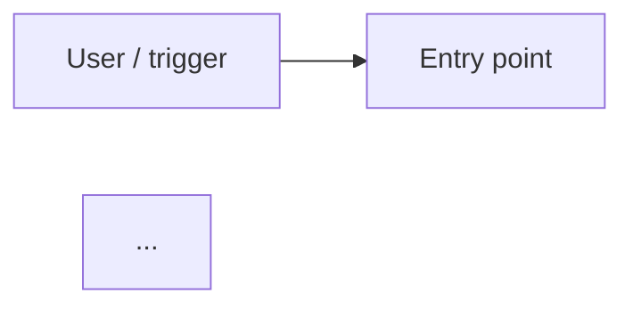

# Plan template

Use this structure for the plan file in P7. The plan must be self-contained. It
may be approved with "clear context", and executed later in auto mode or with
manual approvals, by a session that never saw the interview. Keep code to short
sketches (about 15 lines each at most): interfaces, config keys, a function
signature. No full implementations.

Replace every `{placeholder}`. Remove sections that don't apply, but only when a
decision says so (reference its ID).

---

````markdown
# Agent build plan: {agent-name}

> Planned with agent-builder {skill version} on {YYYY-MM-DD}. Every decision in
> this plan was made by the user; see Appendix A.

## 0. How to execute this plan

- Execute the steps in order. After each step, run its acceptance check. Continue
  only when the check passes.
- If a step can't be done as written (a tool is missing, an API changed, a
  decision turns out to be impossible), **stop and ask the user**. Never
  substitute your own choice. Record the outcome as an amendment in
  `.agent-builder/{agent-name}/decisions.md`.
- Never write secret values into files or logs; use the variable names listed
  in §5.
- Writes to `.claude/` or `.mcp.json` always ask for approval, even in auto mode.
  That is expected.
- The plan works in any approval mode: auto, accept-edits or manual.

## 1. Purpose (D-00, confirmed)

{purpose statement, verbatim}

## 2. Decisions at a glance

| ID | Topic | Decision |
|---|---|---|
| D-01 | Pattern | {…} |

## 3. Architecture

{2–4 sentences: the pattern, the roles, and how data flows.}



## 4. Stack and verified facts

| Item | Value | Source (retrieved) |
|---|---|---|
| Runtime package | {name} {version} | {URL} ({YYYY-MM-DD}) |
| Model: {role} | {model ID} | {URL} ({YYYY-MM-DD}) |

UNVERIFIED facts (re-checked in step 2): {list, or "none"}

## 5. Preconditions

- Tools that must be installed: {e.g. Python ≥ x, uv}. Check with {command}.
- Environment variables (names only): {ANTHROPIC_API_KEY, OPENROUTER_API_KEY, …}
- Accounts and access: {…}

If a precondition isn't met, stop and ask the user.

## 6. Build steps

### Step 1: Persist this plan

1. Pick the folder: `.agent-builder/{agent-name}/`. If `plan.md` already exists
   there, use the next free version suffix (`plan-v2.md` / `decisions-v2.md`,
   then `-v3`, …). Never overwrite.
2. Copy this plan file byte-for-byte into that folder:
   `cp "{plan-file path}" .agent-builder/{agent-name}/plan{suffix}.md`.
   Then delete the one line of that copy that contains the absolute plan-file
   path, so the home directory isn't committed.
3. Write Appendix A of this plan into `decisions{suffix}.md` in the same folder.
   If this plan was edited at approval time, list the differences between §2 and
   Appendix A at the top of `decisions{suffix}.md` as "Amendments at approval".
4. Apply the `.agent-builder/` git decision ({D-id}): {commit it | add
   `.agent-builder/` to `.gitignore`}.

**Acceptance:** both files exist; `git check-ignore -q .agent-builder` exits
{1 if committed | 0 if ignored} (skip this in a non-git folder).

### Step 2: Re-verify fast facts

For every fact in §4, re-check the source. For every UNVERIFIED item, run the
listed check. If anything changed (a newer major version, a renamed model or
API), **stop and ask** before continuing.

**Acceptance:** §4 values confirmed or amended by the user.

### Step {n}: {title}

- **Implements:** {decision IDs}
- **Files:** create `{path}`; modify `{path}`
- **Do:** {concise instructions; code sketch ≤ 15 lines if needed}
- **Commands:** `{command}`
- **Acceptance check:** `{command}` → {expected result}
- **On failure:** {what to try once, then stop and ask}

(Repeat for each step. Order: scaffold → tools and integrations → agent core →
orchestration → guardrails → observability → tests and evals → docs → deploy,
if decided.)

## 7. End-to-end verification

{How to run the agent on a real example, and what a correct result looks like.}

## 8. Evaluation plan

- **Metrics and targets:** {from the metrics decision}
- **Test cases:**

  | ID | Input | Expected | Grader |
  |---|---|---|---|
  | E-01 | {…} | {…} | {programmatic / model-as-judge / human} |

- **How to run:** `{command}`
- **Pass threshold:** {…}
- **When to run:** {on each change / nightly / before release}

## 9. Risks and mitigations

{Every "keep both, accept the risk" resolution, plus risks inherent in the
pattern.}

## 10. Evolution path

{From the evolution decision: what comes next and what interfaces this version
exposes for it.}

## 11. Out of scope

{Non-goals from D-00, and anything deferred, with its trigger.}

## Appendix A: Decisions log

{Full log in the decisions.md format below.}
````

---

## decisions.md format

```markdown
# Decisions: {agent-name}

- Planned: {YYYY-MM-DD} with agent-builder {version}
- Session: {session id}

## D-00 Purpose (confirmed)
{verbatim statement}

## Triage
| ID | Topic | Status | Reason |
|---|---|---|---|

## D-{nn} {topic}
- **Question asked:** {exact text}
- **Options offered:** {option 1 (Recommended)}; {option 2}; …
- **Recommendation and why (Claude):** {…}
- **User's answer:** {option label, or verbatim "Other" text}
- **User's stated reason:** {verbatim, or "none given"}
- **Delegated:** {no | yes: "you decide", scope: this question}
- **Status:** Final | Amended {date}: {what changed and why}
```

Never write a reason on the user's behalf. If they gave none, write "none
given".

## Mermaid rules

- Use `flowchart LR` (or `TB` for tall hierarchies).
- Node IDs are alphanumeric; labels are quoted: `lead["Lead agent"]`.
- One `subgraph` per runtime or trust boundary (for example "Agent runtime",
  "External systems").
- Show the user or trigger, the entry point, the orchestrator and workers, tools
  and MCP servers, memory and stores, external systems, observability and the
  eval harness. Omit components that a decision marked Not applicable.
- Label edges with what flows (`-- "query" -->`); use dotted edges (`-.->`) for
  asynchronous or optional flows.

## Self-check before calling ExitPlanMode

- [ ] Every decision ID in Appendix A is referenced in §2 or a step.
- [ ] No step relies on an undecided choice.
- [ ] Every UNVERIFIED fact appears in step 2.
- [ ] The Mermaid block follows the rules above.
- [ ] No code block exceeds about 15 lines, and none contains secrets.
- [ ] Every step has an acceptance check.
- [ ] Step 1 matches the `.agent-builder/` git decision and the versioning rule.
